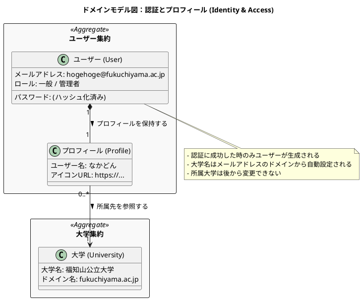

```plantuml
@startuml
title ドメインモデル図：認証とプロフィール (Identity & Access)

rectangle "大学集約" <<Aggregate>> #f9f9f9 {
  class "大学 (University)" as Univ {
    大学名: 福知山公立大学
    ドメイン名: fukuchiyama.ac.jp
  }
}

rectangle "ユーザー集約" <<Aggregate>> #f9f9f9 {
  class "ユーザー (User)" as User {
    メールアドレス: hogehoge@fukuchiyama.ac.jp
    パスワード: (ハッシュ化済み)
    ロール: 一般 / 管理者
  }
  class "プロフィール (Profile)" as Prof {
    ユーザー名: なかどん
    アイコンURL: https://...
  }
}

' 関連
User "1" *-- "1" Prof : プロフィールを保持する >
Prof "0..*" --> "1" Univ : 所属先を参照する >

note bottom of User
  - 認証に成功した時のみユーザーが生成される
  - 大学名はメールアドレスのドメインから自動設定される
  - 所属大学は後から変更できない
end note

@enduml
```
