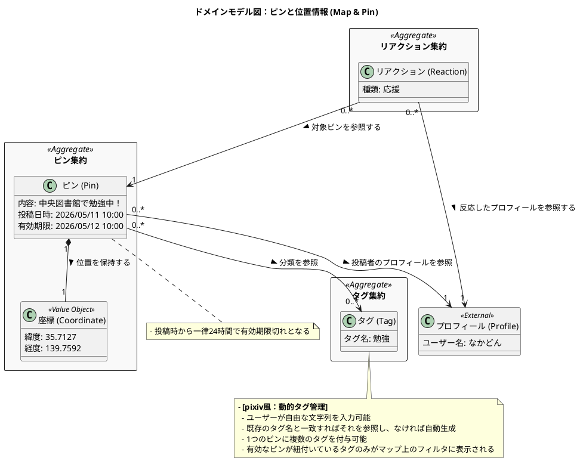

```plantuml
@startuml
title ドメインモデル図：ピンと位置情報 (Map & Pin)

' 1. 他コンテキストの参照
class "プロフィール (Profile)" as Prof <<External>> {
    ユーザー名: なかどん
}

' 2. 集約の範囲
rectangle "ピン集約" <<Aggregate>> #f9f9f9 {
  class "ピン (Pin)" as Pin {
    内容: 中央図書館で勉強中！
    投稿日時: 2026/05/11 10:00
    有効期限: 2026/05/12 10:00
  }
  class "座標 (Coordinate)" as Coord <<Value Object>> {
    緯度: 35.7127
    経度: 139.7592
  }
}

rectangle "タグ集約" <<Aggregate>> #f9f9f9 {
  class "タグ (Tag)" as Tag {
    タグ名: 勉強
  }
}

rectangle "リアクション集約" <<Aggregate>> #f9f9f9 {
  class "リアクション (Reaction)" as React {
    種類: 応援
  }
}

' 3. 関連
Pin "0..*" --> "1" Prof : 投稿者のプロフィールを参照 >

' pixiv風：1つのピンに複数のタグを付与可能にする
Pin "0..*" --> "0..*" Tag : 分類を参照 >

Pin "1" *-- "1" Coord : 位置を保持する >

React "0..*" --> "1" Pin : 対象ピンを参照する >
React "0..*" --> "1" Prof : 反応したプロフィールを参照する >

' 5. ルール/制約(ドメイン知識)
note bottom of Pin
  - 投稿時から一律24時間で有効期限切れとなる
end note

note bottom of Tag
  - <b>[pixiv風：動的タグ管理]</b>
    - ユーザーが自由な文字列を入力可能
    - 既存のタグ名と一致すればそれを参照し、なければ自動生成
    - 1つのピンに複数のタグを付与可能
    - 有効なピンが紐付いているタグのみがマップ上のフィルタに表示される
end note

@enduml
```
