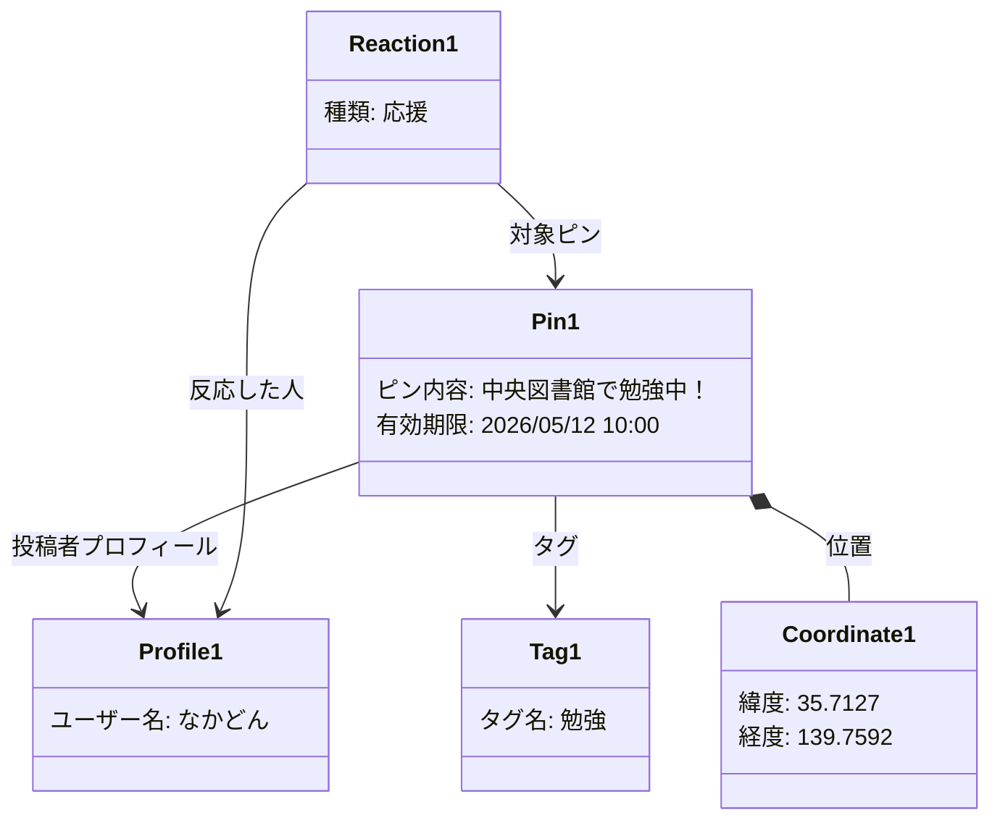

```mermaid
classDiagram
    class Profile1 {
        ユーザー名: なかどん
    }
    class Pin1 {
        ピン内容: 中央図書館で勉強中！
        有効期限: 2026/05/12 10:00
    }
    class Coordinate1 {
        緯度: 35.7127
        経度: 139.7592
    }
    class Tag1 {
        タグ名: 勉強
    }
    class Reaction1 {
        種類: 応援
    }

    Pin1 --> Profile1 : 投稿者プロフィール
    Pin1 --> Tag1 : タグ
    Pin1 *-- Coordinate1 : 位置
    Reaction1 --> Pin1 : 対象ピン
    Reaction1 --> Profile1 : 反応した人
```
