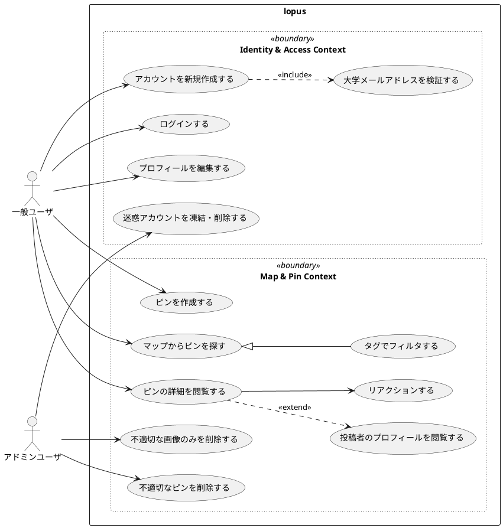

```plantuml
@startuml
left to right direction
actor "一般ユーザ" as User
actor "アドミンユーザ" as Admin

rectangle lopus {
  rectangle "Identity & Access Context" <<boundary>> #line.dotted {
    User --> (アカウントを新規作成する)
    (アカウントを新規作成する) ..> (大学メールアドレスを検証する) : <<include>>
    User --> (ログインする)
    User --> (プロフィールを編集する)
    Admin --> (迷惑アカウントを凍結・削除する)
  }

  rectangle "Map & Pin Context" <<boundary>> #line.dotted {
    ' ピンはプロフィールに紐付いて作成される
    User --> (ピンを作成する)
    
    User --> (マップからピンを探す)
    (マップからピンを探す) <|-- (タグでフィルタする)
    
    User --> (ピンの詳細を閲覧する)
    (ピンの詳細を閲覧する) ..> (投稿者のプロフィールを閲覧する) : <<extend>>
    (ピンの詳細を閲覧する) --> (リアクションする)

    Admin --> (不適切なピンを削除する)
    Admin --> (不適切な画像のみを削除する)
  }
}
@enduml
```
