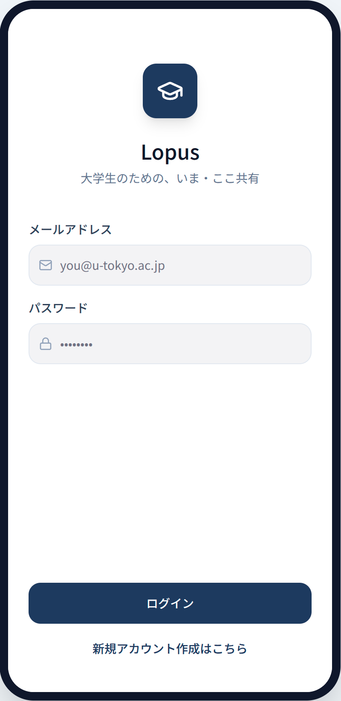
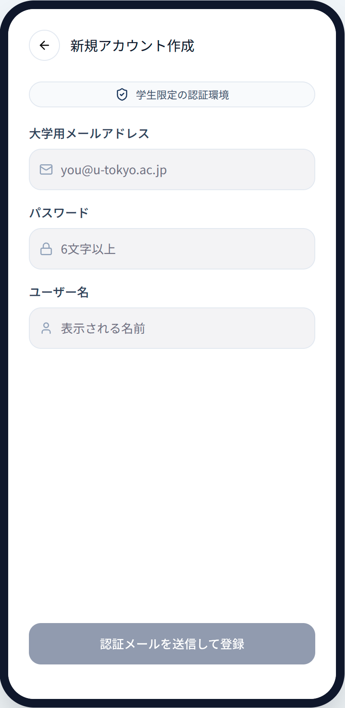
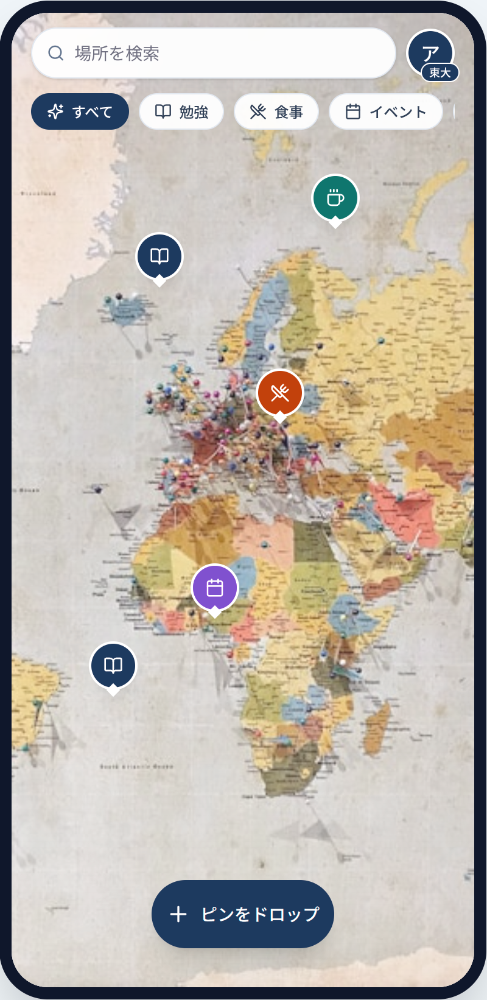

# 画面構成定義: Lopus

本書は、大学生限定のリアルタイム位置情報共有プラットフォーム「Lopus」の画面構成と機能のイメージを定義します。

## 1. 画面構成案 (UI Composition)

### 1.1 ログイン画面 (Login Screen)

- **目的:** 登録済みユーザーのアクセス。
- **要素:**
  - メールアドレス入力欄 (Labels: 「メールアドレス」)
  - パスワード入力欄 (Labels: 「パスワード」)
  - ログインボタン (Labels: 「ログイン」)
  - 新規登録へのリンク (Labels: 「新規アカウント作成はこちら」)

  

### 1.2 新規アカウント作成画面 (Signup Screen)

- **目的:** 大学メールアドレスによる新規登録。
- **要素:**
  - 大学メールアドレス入力欄 (Labels: 「大学用メールアドレス」)
  - ドメイン検証フィードバック (例: 「.ac.jp 認証済み」)
  - パスワード設定欄 (Labels: 「パスワード」)
  - ユーザー名入力欄 (Labels: 「ユーザー名」)
  - 登録ボタン (Labels: 「認証メールを送信して登録」)
    

### 1.3 メインマップ画面 (Main Map View)

- **目的:** 全ユーザーの投稿を地図上で閲覧。
- **要素:**
  - 全画面インタラクティブマップ。
  - 投稿用ボタン (FAB) (Labels: 「ピンをドロップ」)
  - タグフィルタ (Labels: 「すべて」, 「勉強」, 「食事」, ユーザーが作成したカスタムタグが並ぶ)
  - プロフィールアイコン (大学バッジ付き)

  

### 1.4 投稿ドロワー (Pin Submission Drawer)

- **目的:** 24時間限定の投稿とカスタムタグの作成。
- **要素:**
  - テキスト入力エリア
  - **カスタムタグ入力/選択欄:** 既存のタグから選ぶか、新しいタグを自由に入力して作成できる (Placeholder: 「タグを入力または選択」)
  - 写真アップロード用プレースホルダー
  - 投稿ボタン (Labels: 「24時間限定で投稿」)

### 1.5 ピン詳細カード (Pin Detail Card)

- **目的:** 投稿内容の閲覧。
- **要素:**
  - ユーザー名・大学名 (例: 「東京大学」)
  - **カスタムタグ表示:** 投稿時に設定されたタグを表示。
  - 投稿内容（テキスト・画像）
  - 有効期限インジケーター (Labels: 「残り時間」 + 24時間カウントダウン)

---

## 2. Figma Make 用プロンプト (Recommended Prompt)

Figma の **Make Design** を使用する際は、以下の英語プロンプトをそのまま使用してください。

```text
Design a simple mobile app mockup for "Lopus", a location-based social platform for university students.
**Important:** All UI text, labels, and placeholders must be in **Japanese**.
**Style:** Clean functional mockup, minimalist wireframe-to-mockup aesthetic, focus on spatial composition.

**Key Screens to include:**
1. **Login Screen:** Minimalist layout. Fields for "メールアドレス" and "パスワード". Primary button "ログイン".
2. **Signup Screen:** Focused on academic verification. Fields for "大学用メールアドレス", "パスワード", and "ユーザー名".
3. **Main Map View:** Full-screen map. A prominent bottom-center FAB labeled "ピンをドロップ". Top horizontal scrolling filter chips for tags (e.g., "すべて", "勉強", "食事", and custom tags).
4. **Pin Submission Drawer:** A bottom sheet with a text area. Include a special field for "タグを入力・選択" where users can type to create their own custom tags. Photo placeholder included. Post button labeled "24時間限定で投稿".
5. **Pin Detail Card:** Map overlay showing: User info, "大学名", the custom tag assigned to the pin, text content, and a "残り時間" indicator with a 24h countdown.

**Visual Guidance:** Use an "Academic and Fresh" color palette (Navy Blue, Slate Gray, White). Prioritize clarity and layout over complex graphics.
```

---

## 3. デザイン指針

- **ミニマリスト:** 広い余白とシンプルなタイポグラフィ。
- **タグの柔軟性:** ユーザーが自由にタグを作れるため、タグが並んだ際の視認性を考慮したチップデザインを採用する。
- **アカデミック:** 清潔感のあるネイビーとホワイトを基調とする。
